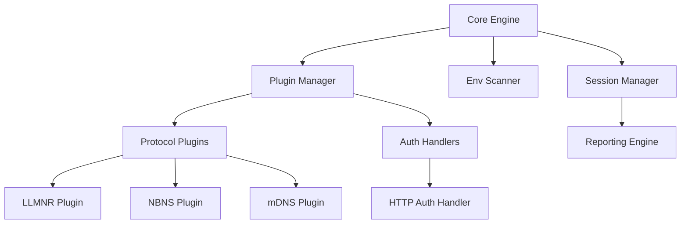

# 🔥 NetPhantom Framework

**NetPhantom** is a modular, production-grade internal network credential interception framework built for high-stability, stealth-aware offensive security operations.

## 🏗️ Architecture

NetPhantom utilizes an asynchronous, event-driven core capable of orchestrating multiple poisoning protocols and authentication handlers simultaneously.



## 🚀 Key Features

- **Asynchronous Engine**: Powered by `asyncio` for non-blocking network I/O.
- **Environment Awareness**: Detects SMB signing, domain context, and IPv6 availability before engagement.
- **Config-Driven**: Profile-based execution using YAML templates.
- **Structured Observability**: JSON-formatted logging for SIEM integration.
- **Professional Reporting**: Auto-generated Markdown reports mapped to MITRE ATT&CK Framework.

## 🛠️ Getting Started

### Prerequisites
- Python 3.11+
- Root/Administrator privileges (for raw socket access)

### Installation
```bash
poetry install
```

### Usage
```bash
# Execute with a specific profile
poetry run python -m netphantom.ui.main --profile profile.yaml

# Dry-run for scope validation
poetry run python -m netphantom.ui.main --profile profile.yaml --dry-run
```

## 🛡️ Security & Legal Disclaimer

> [!CAUTION]
> **FOR AUTHORIZED USE ONLY.** 
> Use of NetPhantom is strictly limited to authorized security testing, research, and educational purposes. Unauthorized use against any network without explicit, written permission is strictly prohibited and may violate local and international laws. The authors assume no liability for misuse of this tool.

## 📜 MITRE ATT&CK Mapping
- **T1557.001**: LLMNR/NBT-NS Poisoning and SMB Relay (Interception)
- **T1557**: Adversary-in-the-Middle (Credential Capture)

## 📄 License
Licensed under the MIT License.
